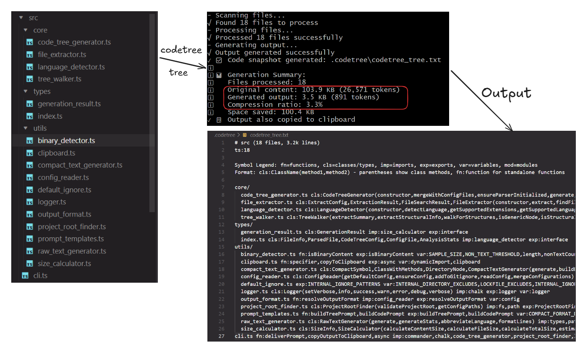
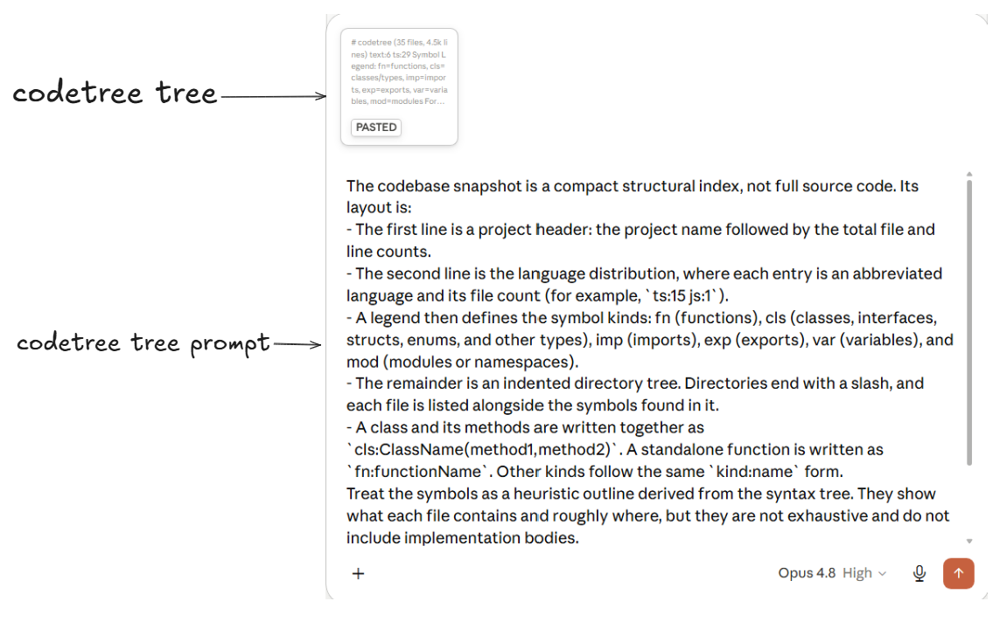
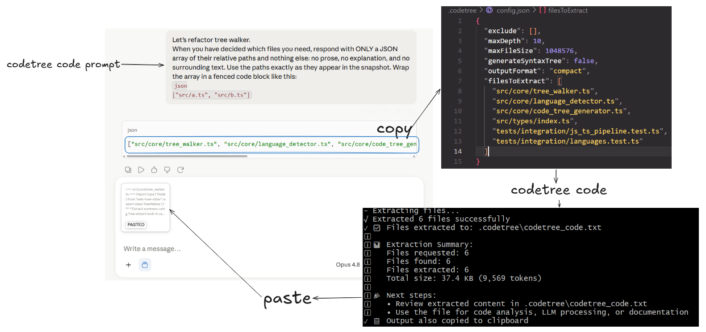

# CodeTree

A command-line tool that uses [Tree-sitter](https://tree-sitter.github.io/tree-sitter/) to turn a codebase into a single, token-efficient snapshot you can hand to a large language model.

<p align="center">
  
</p>

In the example above, codetree repo itself drops from ~26.5k tokens of source (103.9 KB) to under 900 tokens (3.5 KB) — about 3% of the original, while keeping a structural map of every file.

CodeTree produces two kinds of snapshot:

- **Compact** (default) — a structural index of the project. Each file is listed alongside the functions, classes, imports, exports, variables, and modules found in it, derived from the syntax tree. This is dramatically smaller than the source and is meant to give a model a map of the codebase.
- **Raw** — the complete source of every matching file, concatenated with clear delimiters. Use this when the model needs to read implementations directly.

A companion `code` command extracts the full contents of a hand-picked set of files, which pairs naturally with the compact index: show the model the map, let it tell you which files it needs, then extract exactly those.

## Installation

Install globally from npm:

```bash
npm install -g @blackcoffee2/codetree
```

For local development:

```bash
git clone https://github.com/blackcoffee2/codetree
cd codetree
npm install
npm run build
npm link
```

Requires Node.js 20 or newer.

## Quick start

Run from your project root:

```bash
# Compact structural index of the whole project -> .codetree/codetree_tree.txt
codetree tree

# Index a specific subdirectory
codetree tree src

# Full source instead of an index
codetree tree --format raw
```

The typical workflow for using a snapshot with an LLM:

1. `codetree tree` to generate the compact index (`.codetree/codetree_tree.txt`).

2. `codetree tree prompt` to copy a short prompt that explains the snapshot's layout to the model. Paste the prompt, then the snapshot, into your LLM, and it can reason about the whole project from the compact map.

<p align="center">
  
</p>

3. Ask your question. When the model needs the full contents of specific files, `codetree code prompt` copies a prompt that makes it reply with a JSON array of file paths.

4. Put that array into the `filesToExtract` key of `.codetree/config.json` (or pass it via `--files`), then run `codetree code` to produce `.codetree/codetree_code.txt` with the full source of just those files.

<p align="center">
  
</p>

> Run CodeTree from your project root — the directory that holds `.gitignore` and your manifest (`package.json`, `pyproject.toml`, and so on). Configuration and `.gitignore` are read from the current working directory, not from the directory being scanned, so scanning a subdirectory still uses the project's single configuration.

## Commands

### `tree [directory]`

Generate a snapshot of a directory (defaults to the current directory).

| Option                        | Description                                                                                                                       |
| ----------------------------- | --------------------------------------------------------------------------------------------------------------------------------- |
| `-o, --output <file>`         | Output file path. Defaults to `.codetree/codetree_tree.txt`.                                                                      |
| `-f, --format <format>`       | `compact` (default) or `raw`.                                                                                                     |
| `-e, --exclude <patterns...>` | Additional glob patterns to exclude. These are added to the configured exclusions, not a replacement for them.                    |
| `-d, --max-depth <number>`    | Maximum directory depth to traverse, counted from the scan root.                                                                  |
| `-s, --max-size <size>`       | Maximum file size to process, in KB. Larger files are skipped.                                                                    |
| `--syntax-tree`               | Include full syntax trees in the output. Compact format only, and it increases output size significantly. Ignored for raw format. |
| `--no-gitignore`              | Skip reading `.gitignore`. Without it, build artifacts and dependencies will likely be included.                                  |
| `--no-config`                 | Skip reading `.codetree/config.json`.                                                                                             |
| `--verbose`                   | Enable verbose logging.                                                                                                           |

Examples:

```bash
codetree tree src -o snapshot.txt
codetree tree . -d 3 -s 200 --verbose
codetree tree . -e "**/*.test.ts" "**/fixtures/**"
codetree tree . --format raw
```

### `tree prompt`

Copy an LLM prompt that explains how to read a generated tree snapshot. The wording is selected for whichever format the project is configured to produce, so the model is told how to interpret the exact artifact it will receive.

```bash
codetree tree prompt            # copy to clipboard
codetree tree prompt --print    # write to stdout instead
```

If no clipboard is available (common over SSH or in CI), the prompt is printed instead so it is never lost.

### `code`

Extract the full contents of specific files and write them to one output file.

| Option                | Description                                                                                 |
| --------------------- | ------------------------------------------------------------------------------------------- |
| `--files <files>`     | Comma-separated list of files to extract, for example `main.ts,src/utils.ts,lib/config.js`. |
| `-o, --output <file>` | Output file path. Defaults to `.codetree/codetree_code.txt`.                                |
| `--no-config`         | Skip reading `.codetree/config.json`.                                                       |
| `--verbose`           | Enable verbose logging.                                                                     |

If `--files` is omitted, the list is read from the `filesToExtract` key in `.codetree/config.json`. Each requested file is first looked up at its exact path; if not found there, the project is searched by filename, preferring shorter paths and common source directories.

```bash
codetree code --files "main.ts,helper.js"
codetree code --files "src/utils.ts,lib/config.js"
codetree code            # uses filesToExtract from the config file
```

### `code prompt`

Copy an LLM prompt that instructs the model to identify the files it needs and respond with only a JSON array of their relative paths — the exact shape the `filesToExtract` config key expects, so the result can be pasted straight in.

```bash
codetree code prompt
codetree code prompt --print
```

### `languages`

List the languages that produce a Tree-sitter structural summary, with their file extensions.

```bash
codetree languages
```

### `validate`

Check the project structure and configuration: confirm `.gitignore` is present (unless `--no-gitignore` is passed), confirm `.codetree/config.json` is valid JSON with a valid `outputFormat`, and report any detected project manifests.

```bash
codetree validate
codetree validate --no-gitignore
```

## Output formats

Both formats begin with the same two header lines: a project header with the name and total file and line counts, then a language distribution where each entry is an abbreviated language and its file count (for example, `ts:18 js:1 text:3`).

The **compact** format then prints a symbol legend followed by an indented directory tree. Directories end with a slash, and each file is listed with the symbols found in it. A class and its methods are written together as `cls:ClassName(method1,method2)`; a standalone function is `fn:functionName`; other kinds follow the same `kind:name` form. These symbols are a heuristic outline drawn from the syntax tree — they show what each file contains and roughly where, but they are not exhaustive and do not include implementation bodies.

The **raw** format instead emits each file as a `=== relative/path ===` delimiter line followed by the file's full contents, with a blank line between files.

## Configuration

On its first run in a project, CodeTree creates `.codetree/config.json` with default settings and adds `.codetree/` to the project's `.gitignore`. This setup is skipped when `--no-config` is passed, and an existing `.codetree` directory is never overwritten, so your edits are preserved.

```json
{
  "exclude": [],
  "maxDepth": 10,
  "maxFileSize": 1048576,
  "generateSyntaxTree": false,
  "outputFormat": "compact"
}
```

| Key                  | Description                                                                          |
| -------------------- | ------------------------------------------------------------------------------------ |
| `exclude`            | Glob patterns to exclude, fully under your control. Starts empty.                    |
| `maxDepth`           | Maximum directory depth to traverse.                                                 |
| `maxFileSize`        | Maximum file size to process, in bytes.                                              |
| `generateSyntaxTree` | Whether to include full syntax trees (compact format only).                          |
| `outputFormat`       | `compact` or `raw`.                                                                  |
| `filesToExtract`     | Optional. The list of files the `code` command extracts when `--files` is not given. |

Settings are resolved in priority order: command-line options, then the config file, then the built-in defaults. An omitted command-line flag is left unset so the config file can take effect rather than being overridden by a default.

There is intentionally no `include` key — scope a snapshot to part of a project by passing a directory to `tree`. There is also no key for reading `.gitignore`: it is always read unless `--no-gitignore` is passed for a single run.

### Always-on exclusions

Regardless of configuration, CodeTree always excludes the version-control directory (`.git`), its own directory (`.codetree`), and common lockfiles (`package-lock.json`, `yarn.lock`, `pnpm-lock.yaml`, `Cargo.lock`, `poetry.lock`, `go.sum`, and others). Lockfiles are excluded because they are committed to source control — so `.gitignore` does not cover them — and are never useful in a snapshot. Language- and ecosystem-specific dependency and build directories (`node_modules`, `target`, `.venv`, and so on) are left to `.gitignore`, which reliably lists them.

Binary files are detected by inspecting their leading bytes rather than by extension, so the check is language-agnostic and catches binaries with text-like or absent extensions.

## Supported languages

Files in any language are included in a snapshot as plain text. The following languages additionally produce a Tree-sitter structural summary in the compact format:

- **JavaScript** (`.js`, `.mjs`, `.cjs`)
- **JSX** (`.jsx`)
- **TypeScript** (`.ts`, `.d.ts`)
- **TSX** (`.tsx`)
- **Python** (`.py`, `.pyw`, `.py3`)
- **Java** (`.java`)
- **Kotlin** (`.kt`, `.kts`)
- **Go** (`.go`)
- **Rust** (`.rs`)
- **C++** (`.cpp`, `.cxx`, `.cc`, `.c++`, `.hpp`, `.hxx`, `.hh`, `.h++`)
- **C** (`.c`, `.h`)
- **Dart** (`.dart`)
- **Swift** (`.swift`)

Grammars are loaded as WebAssembly via `web-tree-sitter`, so there is no native compilation step. A file whose grammar is missing or fails to parse is still included — it is simply listed without a structural summary rather than dropped.

## Development

```bash
# Build to dist/
npm run build

# Run from source without building
npm run dev -- tree src

# Run the test suite
npm test
```

## License

MIT — see the LICENSE file for details.
